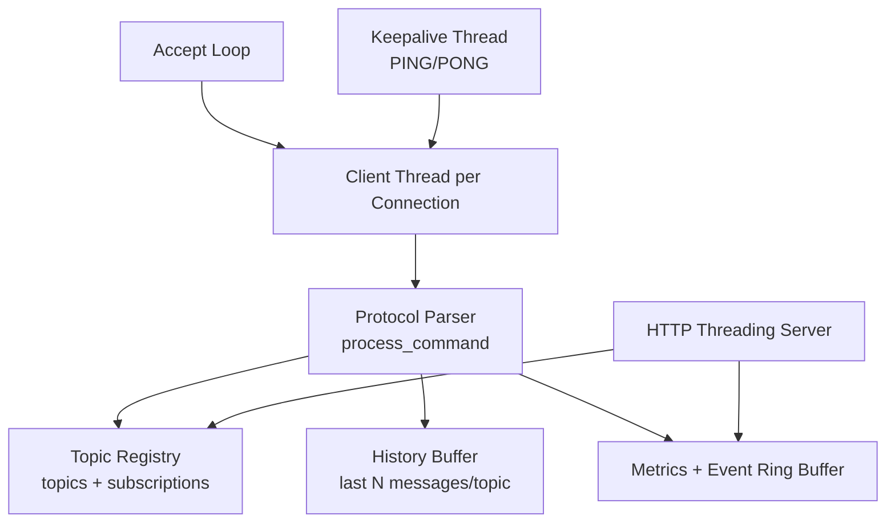

# Architecture and Protocol Design

## Problem Definition
Design and implement a secure socket-based Publish/Subscribe system that demonstrates:
- Low-level TCP socket programming
- Concurrent multi-client communication
- Explicit application protocol design
- SSL/TLS-protected control and data channels
- Monitoring and performance visibility

## Objectives
1. Route topic-based messages from publishers to subscribers in real time.
2. Support multiple concurrent clients safely.
3. Protect all broker-client communication with TLS.
4. Preserve reliability through keepalive checks and robust error handling.
5. Provide observability (topic/client/event metrics) and benchmarkability.

## System Components
- `server.py`: central broker, TCP protocol handler, keepalive manager, in-memory metrics, dashboard/API host.
- `publisher.py`: socket client that sends `PUBLISH` frames and waits for `ACK`.
- `subscriber.py`: socket client that sends `SUBSCRIBE` and consumes `MESSAGE` frames.
- `dashboard.html`: live monitoring UI powered by `/api/snapshot` and `/api/publish`.
- `scripts/load_harness.py`: concurrent benchmark runner for rubric performance evaluation.

## High-Level Architecture
```mermaid
flowchart LR
    P1[Publisher Client(s)] -->|TLS over TCP| B[PubSub Broker\nserver.py]
    S1[Subscriber Client(s)] -->|TLS over TCP| B
    B -->|MESSAGE frames| S1
    D[Dashboard Browser] -->|HTTP API| B
    H[Load Harness] -->|TLS over TCP| B
```

## Broker Internals


## Socket Protocol
Frames are newline-delimited UTF-8 strings.

### Client Commands
- `PUBLISH|<topic>|<message>`
- `SUBSCRIBE|<topic>`
- `UNSUBSCRIBE|<topic>`
- `LIST_TOPICS`
- `STATS`
- `LIST_CLIENTS`
- `PONG`
- `DISCONNECT`

### Broker Responses
- `ACK|<message>`
- `ERROR|<message>`
- `MESSAGE|<topic>|<publisher_addr>|<timestamp>|<content>`
- `TOPICS|<comma_separated_topics>`
- `STATS|<json>`
- `CLIENTS|<csv_like_entries>`
- `PING`

## Dashboard/API Endpoints
- `GET /api/health`: broker status
- `GET /api/snapshot`: full observability snapshot (topics, clients, events, metrics)
- `POST /api/topic`: create topic without publishing seed message
- `POST /api/publish`: publish from dashboard/API

## Runtime Deployment Modes
- Local mode (single laptop):
  - `python server.py`
- LAN demo mode (multi-laptop):
  - `python server.py --host 0.0.0.0 --port 9999 --dashboard-host 0.0.0.0 --dashboard-port 8088`
- Remote clients:
  - `python subscriber.py --host <SERVER_LAN_IP> --port 9999`
  - `python publisher.py --host <SERVER_LAN_IP> --port 9999`

## Security Flow (TLS)
1. Server loads certificate/key from `certs/server.crt` and `certs/server.key`.
2. Incoming TCP sockets are wrapped with `ssl.SSLContext(ssl.PROTOCOL_TLS_SERVER)`.
3. Clients use TLS sockets and connect to broker host/port.
4. For local lab usage, clients skip CA verification (`CERT_NONE`) because certificate is self-signed.
5. If cert/key is missing, broker startup fails clearly and instructs running `generate_certs.sh`.

## Concurrency Model
- Thread-per-client for broker socket handling.
- Dedicated keepalive thread periodically sends `PING` and drops stale clients.
- Dashboard/API runs on `ThreadingHTTPServer` for concurrent HTTP requests.
- Shared mutable state (`topics`, `clients`, `history`, metrics) is protected by a broker lock.

## Reliability and Error Handling
- Message history replay for new subscribers.
- Defensive handling of malformed commands (`ERROR` responses).
- Timeout and connection-reset handling in client threads.
- Safe disconnect cleanup to prevent stale subscriptions.
- Keepalive-based dead-client detection (`PING_INTERVAL` + `PING_TIMEOUT`).
